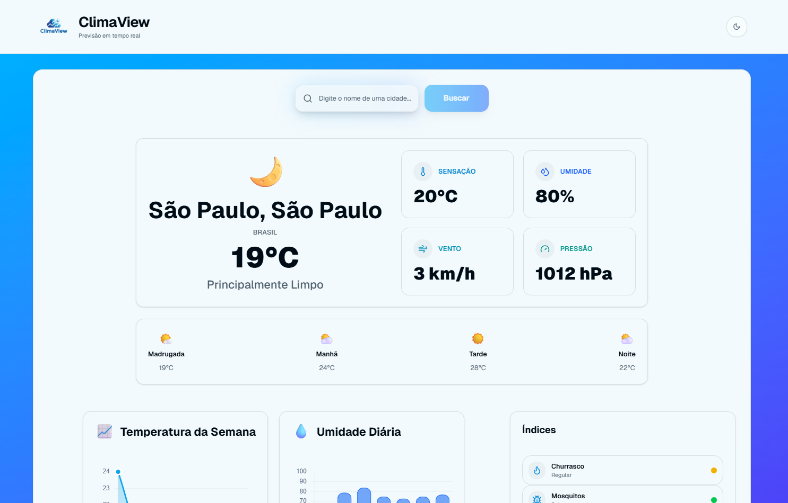

<p align="center">
  
</p>
# ClimaView — Dashboard de Clima Moderno

[](https://github.com/aMathyzinn/ClimaView)

[](https://github.com/aMathyzinn/ClimaView/stargazers)
[](https://github.com/aMathyzinn/ClimaView/issues)
[](https://nextjs.org/)
[](https://tailwindcss.com/)
[](https://www.typescriptlang.org/)
[](https://www.chartjs.org/)
[](https://open-meteo.com/)

Perfil: https://github.com/aMathyzinn • Repositório: https://github.com/aMathyzinn/ClimaView

## Visão Geral

ClimaView é um dashboard de clima com foco em usabilidade e visual limpo. Ele busca dados em tempo real da Open‑Meteo, apresenta previsões por períodos do dia, gráficos semanais, e um painel de índices dinâmicos (churrasco, mosquitos, frizz, ressecamento da pele, gripe/resfriado e UV) calculados com base na condição atual e nas próximas horas.

## Preview

<p align="center">
  
</p>

## Recursos

- UI responsiva e performance com Next.js 16 + Tailwind 4
- Busca por cidade com sugestões (geocoding Open‑Meteo)
- Períodos do dia calculados a partir do `hourly`
- Gráficos semanais de temperatura e umidade (Chart.js)
- Índices dinâmicos baseados em temperatura/umidade/vento e precipitação nas próximas horas
- Tema claro/escuro persistente sem flicker

## Instalação

```bash
# Node 18+
npm install
npm run dev
```

- Dev: `http://localhost:3000`
- Build: `npm run build` e `npm start`
- Typecheck: `npx tsc --noEmit`

## Estrutura

```
app/
  actions.ts         # Server Action: busca e transforma dados Open‑Meteo
  layout.tsx         # Tema e layout básico
  page.tsx           # Home (agrupador do conteúdo)
components/
  navbar.tsx         # Header responsivo
  search-bar.tsx     # Busca com sugestões
  weather-card.tsx   # Atual + períodos (madrugada/manhã/tarde/noite)
  forecast-chart.tsx # Gráficos: temperatura semanal e umidade diária
  forecast-cards.tsx # Previsão dos próximos dias
  indices-panel.tsx  # Índices dinâmicos (churrasco, mosquitos, etc.)
  weather-background.tsx # Background climático discreto
lib/
  weather.ts         # Utilidades (descrições WMO)
```

## API Open‑Meteo

- Geocoding:
  - `https://geocoding-api.open-meteo.com/v1/search?name=<cidade>&count=1&language=pt&format=json`
- Forecast:
  - `https://api.open-meteo.com/v1/forecast?latitude=<lat>&longitude=<lon>&current=temperature_2m,relative_humidity_2m,apparent_temperature,is_day,precipitation,weather_code,cloud_cover,pressure_msl,wind_speed_10m,wind_direction_10m&hourly=temperature_2m,relative_humidity_2m,precipitation_probability,precipitation,weather_code,wind_speed_10m,uv_index&daily=weather_code,temperature_2m_max,temperature_2m_min,precipitation_probability_max,uv_index_max,wind_speed_10m_max,wind_gusts_10m_max&timezone=auto&forecast_days=7`
- Cache leve via `{ next: { revalidate } }` para melhor equilíbrio entre frescor e performance.

### Índices Dinâmicos (como são calculados)

- Churrasco: combina `tempNow`, `windNow` e média de `precipitation_probability` nas próximas 6h.
- Mosquitos: favorecidos por `tempNow ≥ 24ºC` e `humNow ≥ 65%`.
- Frizz: escala com `humNow` (≥ 70 alto). 
- Ressecamento: escala inversa com `humNow` (≤ 30 alto).
- Gripe/Resfriado: depende de frio atual, amplitude térmica diária e vento.
- UV: usa índice horário quando disponível, senão `uv_index_max` diário.

## Scripts

- `npm run dev` — servidor de desenvolvimento
- `npm run build` — build de produção
- `npm start` — serve build
- `npx tsc --noEmit` — verificação de tipos

## Customização

- Troque cores/raios em `app/globals.css`.
- Ajuste thresholds dos índices em `components/indices-panel.tsx`.
- Edite tipografia/espacamentos em `weather-card.tsx` e `forecast-cards.tsx`.

## Contribuição

1. Faça um fork
2. Crie uma branch: `git checkout -b feat/minha-feature`
3. Commit: `git commit -m "feat: minha feature"`
4. Push: `git push origin feat/minha-feature`
5. Abra um PR

## Licença

MIT — use livremente para projetos pessoais e comerciais.

---

Se curtir, deixe uma ⭐ no repositório. Feedbacks são muito bem‑vindos!

[](https://github.com/aMathyzinn/ClimaView)
